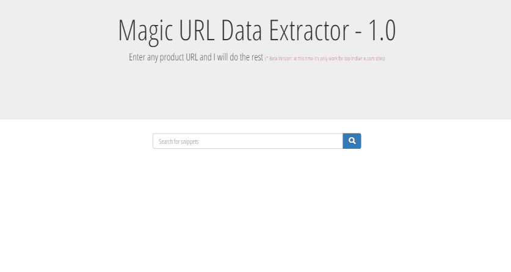

# Magic URL Data Extractor
 
Our Scripts behind this: 
 <code> 
 
  
 </code>
 
Magic URL extractor is a cross domain data extractor plugin, we are busy in developing a optimize plugin for various purpose.
Till now use this plugin to extract cross domain commerce product details with URL (at this time plugin in beta version so only support top e commerce sites in India).
  

 
<h2> How it works ? </h2>
 
As we know well browser didn't support cross domain request for accessing external data without JSONP, so our concept is simple based on such logic. When you proceed search button we requested to load URL in encrypted mode and while processing convert html data in xml/json format.
 
It's not easy to handle complete external DOM data without affecting your server load time so we create a virtual DOM and access data with variable.
 
Our next step to filter data for Ajax, Css and Javascript request, after filtering all those things we process with converting in html format and store in local container.
We again process request for find exact data from container and after getting all required result we display actual product only data.
  
URL --> Proxymapping --> CrossDomain request --> Request and save html data in Json --> Filter data for avoid concole erros and DOM optimixzation --> Process various data handling --> Show result
 
<h3> Complete Documentation will be available soon, till now any contribution appreciated </h3>
